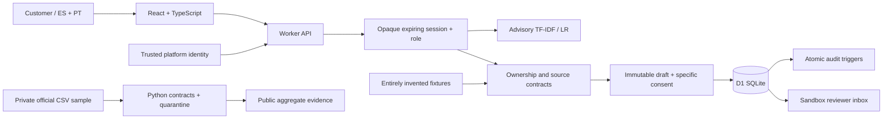

# Reclama

**De un cargo desconocido a un expediente verificable.** A working Spanish/Portuguese dispute-intake sandbox for the Factored AI & Data Hackathon 2026.

Reclama identifies a customer's transaction, keeps source facts separate from their statement, obtains specific consent, persists one case and gives a human reviewer an auditable handoff. It does **not** adjudicate fraud, approve credit, issue refunds, freeze cards or move money.

**[Open the private team demo](https://reclama-factored-2026.villafortech.chatgpt.site)** · **[Private team source](https://github.com/VillaforTech/factored-hackathon-2026-reclama)**

The demo and repository are private at the owner’s request. Access is restricted to the owner and explicitly invited teammates. Case operations use normal ChatGPT sign-in and an isolated sandbox; there are no bank integrations. Hosted sign-in was blocked by the identity provider’s security verification in our automated browser, so the hosted authenticated workflow remains a separate acceptance item.

Team: Roberto Villafuerte, Jorge Arguello and Daniel Andrade. Responsibilities proposed in `docs/DELIVERY_PLAN.md` must be agreed with the team; no individual expertise is assumed.

**[Explore the interactive project guide (Spanish)](https://reclama-factored-2026.villafortech.chatgpt.site/guia)** — eleven chapters explain the product decision, data limitations, case lifecycle, architecture, learned model, evaluation, safeguards and delivery process. Interactive examples run locally in the page and do not create cases. The guide links to the exact V3 source and evidence it explains; it shares the demo's private access policy.

## Run locally

Node.js 22.13+ and Python 3.11+ are sufficient for the web app, data-contract fixtures and HTTP tests. No paid API key is required.

```sh
npm run install:ci
npm run build
npm run db:local
npm run dev
```

Open the exact loopback URL printed by the server. Use **Entrar con ChatGPT**; the Sites starter provides a clearly local mock identity only on loopback. Then start a sandbox. The production deployment uses platform-authenticated identity. Do not expose the development server to the Internet or trust arbitrary `oai-authenticated-*` headers behind another proxy.

Choose Ana (Spanish, USD/COP) or Lucas (Portuguese, ARS). Select a movement, explicitly choose the reason, write a statement and review the immutable summary. The confirmation checkbox is required. In **Mesa de revisión**, explicitly enter the sandbox reviewer role to add a review note. This role switch is an educational simulation within your own workspace, not a real bank workforce identity system.

**Laboratorio de resiliencia** can simulate a lost response after a successful database commit. Retry the same request to recover the existing case. A different request for an already registered movement returns a conflict; find the original in the review inbox. Expired sessions cannot write; after starting a new session, the inbox recovers existing cases.

## Guided case workflow

The assistant now returns source-backed transaction candidates from the message (ES/PT amount, merchant, currency, card suffix and exact date). Similar purchases are shown side by side and never automatically selected. The learned model proposes an unconfirmed intent; deterministic matching and server authorization are separate.

Use **Usar este relato** to copy a message into the declaration without paraphrasing. Switching ES/PT preserves the active transaction, declaration and confirmation. The confirmation sheet separates source data, the customer statement and questions still requiring investigation. The receipt links to the reviewer’s persisted case.

**Nuevo recorrido** creates a fresh owner-scoped scenario so the team can repeat the demo. Previous cases are retained and can be reopened from the run selector. Changing runs discards an unconfirmed form; the dialog says so before creation. Session expiry clears sensitive UI context and cancels pending requests. A hashed session-context marker rejects stale-tab reads and writes after another tab changes persona, role or run; it never grants authorization. The guest/public sandbox proposal was not implemented: every API still requires platform identity.

## Architecture



The learned model only interprets a message. It cannot select an account, change a role, grant authorization, create consent or call a financial tool. Server code owns these decisions. Money remains integer minor units plus ISO currency. Source snapshot and provenance are visible.

## Evidence and reproducibility

- `data-pipeline/`: structural checks and explicitly authored demo fixtures. The private organizer CSVs and the access-bearing dictionary are deliberately absent. Run `python3 data-pipeline/validate_assets.py` for fixture validation. See `data-pipeline/data-card.md` before reproducing the optional private-data profile.
- `ml/`: frozen v1/v2 models, authored corpora, rule baseline, independent reserved set, predictions, model cards and Python/JavaScript parity checks. See `ml/README.md`; run `node ml/v2/verify-parity.mjs`. The UI uses v2.
- `tests/`: acceptance specification and real HTTP harness. `python3 tests/http-integration.py --base-url http://127.0.0.1:5173`. It creates synthetic cases; run against a fresh local fixture database for a complete first pass. It never deletes cases and reports exhausted fixtures instead of silently resetting them.
- `docs/evidence/`: timestamped measured reports. Designed tests, executed integration checks, exploratory model scores and reserved evaluations are different evidence types.
- `npm run check` verifies TypeScript and application lint; `npm run build` produces the Worker bundle.

Measured official sample: 48,810 coherent transaction/product/customer links; 10,903 approved card purchases, including 531 with no merchant. All 448 non-null complaint/product links inspected had different owners and were quarantined. The sample uses 12 time cuts, not a representative random sample. No inspected record is certified as live bank state. Only aggregates are published.

On the independent **256-message synthetic reserved set**, v2 scored **218/256 (85.16%)** versus **168/256 (65.63%)** for rules; macro-F1 was 0.8310 versus 0.6752. The paired-family bootstrap accuracy difference against rules was +19.53 percentage points (95% interval +11.72 to +27.34). ES accuracy: 85.94%; PT: 84.38%. V1 scored 211/256; the v2–v1 difference is not conclusive. These are authored, balanced scenarios, not a representative bank benchmark.

**We rejected autonomous routing.** The frozen validation gate failed; the system always requires clarification and explicit choice. It shows raw top-1 only as an unconfirmed hypothesis. `other` recall is 9/32 and `unrecognized` precision is 25/34. There were zero normalized exact train/validation overlaps with the heldout set; broader semantic and author biases remain possible. Portuguese text and synthetic labels need human review. The earlier exploratory 64-message evaluation remains preserved separately.

Measured system evidence: **16/16 additional run/locale regressions**, **9/9 stale-session context regressions** and **20/20 deterministic assistant tests** passed locally in the prior V3 validation. On 30 September, a new local D1 run passed **28/28 HTTP checks**, **160/160 contract assertions** across 16 bilingual scenarios, and **2/2 separate persisted ES/PT handoff paths**. The 160 requests created no cases; the HTTP suite created four prepared dispute intakes, and the handoff suite created two prepared support cases. These are not 166 independent customers or financial resolutions. A historical report's 2/4 intake/handoff split did not reproduce with the current integration harness; see the [evidence correction](docs/evidence/WORKFLOW_API_EVALUATION.md). Local warm model CPU p95 was 0.082 ms in the earlier benchmark; the new per-scenario local API p50 ranged 5.93–7.49 ms and p95 9.35–36.47 ms with ten measurements each. Neither measure is production end-to-end latency. No external model API calls were made; total hosting/CPU cost has not been measured.

## Security boundaries

- Identity-derived workspace namespace; opaque HttpOnly/SameSite session; server expiry and role checks; same-origin JSON mutations.
- Transaction ownership and source integrity checked at drafting and commit, never from client-supplied amount or merchant.
- Immutable draft + random confirmation token bound to the current session and source fingerprint; ten-minute expiry.
- Unique database indexes for transaction case and idempotency key; read after write; exact-payload replay; atomic audit triggers.
- Version-checked reviewer updates; no endpoint for refund, fraud adjudication or bank mutation.
- Secret-pattern rejection is a limited defense, not a complete PII detector. Do not enter real personal or banking information in this demo.
- Local tests cover two personas under one mock platform identity. Isolation across two real platform accounts has not yet been independently tested.

## Deployment

The project uses the Sites Vinext starter, Cloudflare Worker and D1. `.openai/hosting.json` declares the D1 binding; migrations are versioned in `drizzle/`. Production publication must use the exact pushed source commit and built archive. Deployment status and access audience are documented separately from local tests in `docs/DELIVERY_STATUS.md`.

A bank deployment would replace invented fixtures with an authenticated, read-only bank adapter, use workforce identity for reviewers, add retention/rate limits and operational monitoring, and validate time semantics, jurisdiction-specific policies and language quality. Those integrations are not silently simulated as complete.

## Delivery artifacts

- `docs/presentation/`: editable six-slide V4 review deck and PDF with private-access wording and separate evidence denominators. Team review remains open.
- `docs/video/GUION_VIDEO.md`: current V4 narration, video and subtitles; it is a labeled montage of real local screenshots, not an uninterrupted live screen recording. `docs/DEMO_175S.md` redirects from the older script.
- `docs/DELIVERY_PLAN.md`: daily plan and proposed team assignments through 5 October.
- `docs/DELIVERY_STATUS.md`: verified delivery state and remaining external checks.
- `docs/DEMO_GATE_2026-09-30.md`: prioritized acceptance gaps, requirement-to-evidence matrix and live rehearsal sequence.

## Official challenge references

- [Challenge](https://docs.google.com/document/d/18AwONT8hQupRcfNPLFrPo6fHOJ_OUn1nBf-3jMnla2c/edit)
- [Event hub](https://www.factored.ai/careers/ai-data-hackathon)
- [Deadline and three-minute video clarification](https://factored-hackathon.slack.com/archives/C0BU54YAKMG/p1790614675075619?thread_ts=1790611564.552809)

The 28 September organizer clarification records a deadline of **5 October 2026, 23:59 UTC−5 (continental Ecuador)**; recheck later announcements before submission. The [event hub](https://www.factored.ai/careers/ai-data-hackathon) explicitly requires a public repository, a working deployed link, 4–6 slides and a video. No exception to the public-repository requirement has been verified. The owner has explicitly kept this project private for now; public release and the final submission package remain separate decisions. A built package is not an organizer submission receipt.
