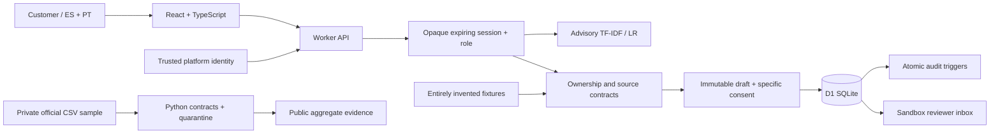

# Reclama

**De un cargo desconocido a un expediente verificable.** A working Spanish/Portuguese dispute-intake sandbox for the Factored AI & Data Hackathon 2026.

Reclama identifies a customer's transaction, keeps source facts separate from their statement, obtains specific consent, persists one case and gives a human reviewer an auditable handoff. It does **not** adjudicate fraud, approve credit, issue refunds, freeze cards or move money.

Team: Roberto Villafuerte, Jorge Arguello and Daniel Andrade. Responsibilities proposed in `docs/DELIVERY_PLAN.md` must be agreed with the team; no individual expertise is assumed.

## Run locally

Node.js 22.13+ and Python 3.11+ are sufficient for the web app, data-contract fixtures and HTTP tests. No paid API key is required.

```sh
npm run install:ci
npm run build
npm run db:local
npm run dev
```

Open the exact loopback URL printed by the server. Use **Entrar con ChatGPT**; the Sites starter provides a clearly local mock identity only on loopback. Then start a sandbox. The production deployment uses platform-authenticated identity. Do not expose the development server to the Internet or trust arbitrary `oai-authenticated-*` headers behind another proxy.

Choose Ana (Spanish, USD/COP) or Lucas (Portuguese, ARS). Select a movement, explicitly choose the reason, write a statement and review the immutable summary. The confirmation checkbox is required. In **Mesa de revisión**, explicitly enter the sandbox reviewer role to add a review note. This role switch is an educational simulation within your own workspace, not a real bank workforce identity system.

**Laboratorio de resiliencia** can simulate a lost response after a successful database commit. Retry the same request to recover the existing case. A different request for an already registered movement returns a conflict; find the original in the review inbox. Expired sessions cannot write; after starting a new session, the inbox recovers existing cases.

## Architecture



The learned model only interprets a message. It cannot select an account, change a role, grant authorization, create consent or call a financial tool. Server code owns these decisions. Money remains integer minor units plus ISO currency. Source snapshot and provenance are visible.

## Evidence and reproducibility

- `data-pipeline/`: structural checks and explicitly authored demo fixtures. The private organizer CSVs and the access-bearing dictionary are deliberately absent. Run `python3 data-pipeline/validate_assets.py` for fixture validation. See `data-pipeline/data-card.md` before reproducing the optional private-data profile.
- `ml/v1/`: frozen exploratory model, synthetic corpus, training script, rule baseline, predictions, model card and Python/JavaScript parity checks. `node ml/v1/verify-parity.mjs`.
- `tests/`: acceptance specification and real HTTP harness. `python3 tests/http-integration.py --base-url http://127.0.0.1:5173`. It creates synthetic cases; run against a fresh local fixture database for a complete first pass. It never deletes cases and reports exhausted fixtures instead of silently resetting them.
- `docs/evidence/`: timestamped measured reports. Designed tests, executed integration checks, exploratory model scores and reserved evaluations are different evidence types.
- `npm run check` verifies TypeScript and application lint; `npm run build` produces the Worker bundle.

Measured official sample: 48,810 coherent transaction/product/customer links; 10,903 approved card purchases, including 531 with no merchant. All 448 non-null complaint/product links inspected had different owners and were quarantined. The sample uses 12 time cuts, not a representative random sample. No inspected record is certified as live bank state. Only aggregates are published.

The first learned model scored 46/64 correct versus 43/64 for a rule baseline, with slightly worse macro-F1. That exploratory result does not establish superiority or justify autonomous routing. Explicit user confirmation remains mandatory. Portuguese text and synthetic labels still need human review.

## Security boundaries

- Identity-derived workspace namespace; opaque HttpOnly/SameSite session; server expiry and role checks; same-origin JSON mutations.
- Transaction ownership and source integrity checked at drafting and commit, never from client-supplied amount or merchant.
- Immutable draft + random confirmation token bound to the current session and source fingerprint; ten-minute expiry.
- Unique database indexes for transaction case and idempotency key; read after write; exact-payload replay; atomic audit triggers.
- Version-checked reviewer updates; no endpoint for refund, fraud adjudication or bank mutation.
- Secret-pattern rejection is a limited defense, not a complete PII detector. Do not enter real personal or banking information in this demo.
- Local tests cover two personas under one mock platform identity. Isolation across two real platform accounts has not yet been independently tested.

## Deployment

The project uses the Sites Vinext starter, Cloudflare Worker and D1. `.openai/hosting.json` declares the D1 binding; migrations are versioned in `drizzle/`. Production publication must use the exact pushed source commit and built archive. Deployment status and access audience are documented separately from local tests in `docs/DELIVERY_STATUS.md`.

A bank deployment would replace invented fixtures with an authenticated, read-only bank adapter, use workforce identity for reviewers, add retention/rate limits and operational monitoring, and validate time semantics, jurisdiction-specific policies and language quality. Those integrations are not silently simulated as complete.

## Official challenge references

- [Challenge](https://docs.google.com/document/d/18AwONT8hQupRcfNPLFrPo6fHOJ_OUn1nBf-3jMnla2c/edit)
- [Event hub](https://www.factored.ai/careers/ai-data-hackathon)
- [Deadline and three-minute video clarification](https://factored-hackathon.slack.com/archives/C0BU54YAKMG/p1790614675075619?thread_ts=1790611564.552809)

The verified deadline is **5 October 2026, 23:59 UTC−5 (continental Ecuador)**. The public repository, working demo or documented local exception, 4–6 slides and maximum-three-minute video are prepared as distinct deliverables. A built package is not an organizer submission receipt.
